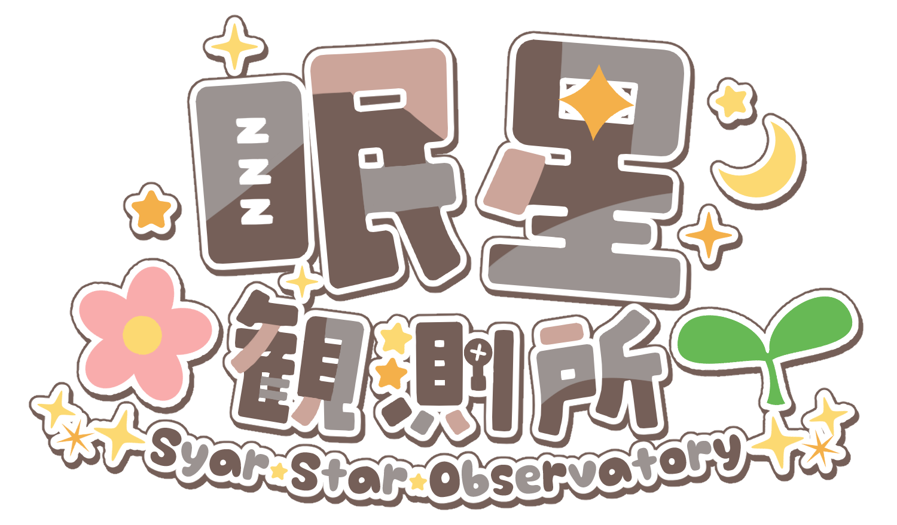

# syarstar-next

## Overview (これはなに？)

React (Next.js) 版の[眠星観測所](https://syarstar.net)のレポジトリだよ

## Requirement

- Node.js 18.17 or later

## Features

最新版以降に実装した内容をここに書きます

## Author

ふるおろいど (Fluoroid)

- [Misskey.io](https://misskey.io/@Fluoroid)
- [GitHub](https://github.com/fluoroid)

## License

ソースコードはMIT Licensesですが、サイト内で公開されている文章や画像(イラスト)等のコンテンツにはCC Licenses (CC BY-NC-ND 4.0)が適用されます。詳しくはLICENSEをご覧ください。

The source code is licensed MIT. The website content is licensed CC BY-NC-ND 4.0, see LICENSE.

